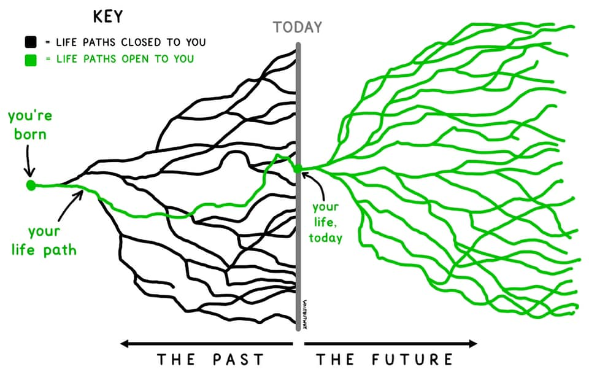

Writing at the beginning of the year is one good step. Although some might be sceptical about setting a new goal that corresponds to “new goals, new me”, setting a goal could happen every time don’t have to wait until the new year, blablabla. Yes, I agree with that, yet, the new year is an excellent momentum to decide a pathway to choose in the future; not everything has to be achieved in the next 365 days indeed. However, I hate being myself: bursting at every opportunity, trying everything that even I do not know if I would need that or not. That was old Yogi. 

I believe you are already tired of reading articles on the Internet about trying to say NO more often, so here is my take the more someone understands what pathway He wants to choose in the future, the more conscious the decision He made and vice versa. For me, the objective of writing all this out, if all my effort is already pointed in what I write here and I consistently do these every day, sooner or later, does not have to be less than 365 days; it becomes a realisation someday.

My personal guideline for my life in 2023 and beyond is “persistency”, written on one page of my pocketbook. When I am about to start something, I often think I might have done this before or I must have done this in the past. For instance, when I wanted to review Machine Learning Specialisation by DeepLearning, which I’ve been doing circa 2017, I lost all my notes and progress (in fact, I did not finish that, but some progress had been made!). Hence, every improvement I make should be centralised somewhere in Github or my personal note Obsidian.

I have six big projects for my future:

1. Travel the world: let’s put the most exciting project of all time first. Travelling to Europe is expensive. Travelling from a close country like the United Kingdom might be cheaper. The farther it gets, the more expensive the plane tickets are. With that in mind, this opportunity to learn in the UK cannot be wasted. After we had done some calculations because we were preparing for the Schengen interview,  approximately one person had to spend around ~1500 pounds for 12 day trip in Europe, in IDR is around 28 million. The plan is a semi-backpack with three-star hotels at max. When I wrote this, we finished submitting our Schengen application to TLScontact in Princes Street. The more detail about our trips will be covered somewhere else.

2. Write and speak fluently. I genuinely want to exercise the opportunity to have permanent residence overseas. I believe Singapore is my main goal before anything changes my mind. The main reasons are life quality, education, traffic (related to public transportation), careers, and finances. At this moment, If I can be honest with you, I still speak English wobbly. From my current examination, the main reasons are anxiety, self-pressure and lack of vocabulary. I tend to speak fast and hope to finish my speech as soon as possible. The way I am doing that is probably because I don't want someone to notice my defect in English. With that, I only use the most common conversational words and more variations of colourful words. Usually, I need to remember about the lexical that I need to speak, making me hesitant and reluctant to talk in English even more. My current approach is bottom-up, as I usually do with complex topics. I try to build a solid foundation of my grammar by reviewing and re-learn again daily about grammatical and vocabulary knowledge. I will spare less than 15 minutes daily to write new words or grammar knowledge inside my second-brain workflow, challenge myself to speak-present more, do regular reviews in my system, etc. This programme will evolve by the time I focus on this project.

3. Combining Finance and Machine Learning. I properly understand how Machine Learning works on a surface area. But when talking about math and adequate integration with the system (engineering side), I doubt myself. I would dedicate myself to understanding and being critical of the fundamental thing in Machine Learning. Linear regression and Logistic regression is an excellent topics to start with. In addition, I aspire to utilise my expertise to tackle Finance problems using Machine Learning. That’s one of the reasons why I picked up FinTech as my major for my master's degree.

4. Grow your www.ygtc.dev portofolio. Showcasing your achievement on a website is fun, to be honest. Tracking back outcomes during the ups is exciting. This project also potentially develops my front-end coding skill that I would not bother to learn in the future. The key idea is to keep everything simple, showcase your achievements, and that’s it! 

5. Running. I have been attached to running since my last year at the University. I am obsessed with it because I followed Casey Neistat's early days on his Youtube channel when He was still in NYC and continuously published their daily Vlog and always talked about his running habit.
Since then, I have been a “street runner” with a less technical plan, and at that time, I mindlessly have a goal to be able to run 10k daily. Running is a great habit, but I would emphasise my world more on academics than running. However, if I decide to run, I need to have a proper plan for why I have to run and how. I am considering joining the half-marathon in the UK, but I am waiting right time and waiting for some of my friends also joining the race. On top of that, Strava also provides some legit training plans for any race type starting from 5k until the marathon, so I am pretty glad about that.

6. MSc of Finance Technology and Policy with Merit. My goal for this degree is to progress and receive merit for my grade. It is a pretty decent achievement for me as a past Sukolilo student who can pursue an international degree. 

### **My direction up to Mid-2023:**

- Europe travels in April, exploring at least 4 countries and exciting attractions. (plus: connect with friends in the EU).

- Write two blogs in a year and understand the new (English or France(?)) 132 vocabulary.

- Join a new gig, so you can exercise your English or present your work to other people (plus: receive money).

- Focus on how to present your work to others using online platform ygtc.dev and committed to workplan on [Things3](https://culturedcode.com/things/) (A GTD apps that helps me managing projects).

- Drafting Thesis that joins two fields: machine learning and finance (plus: published internationally or conference)

- Follow proper training for Edinburgh Half-Marathon Running (plus: publish a running story, plus: join a community).