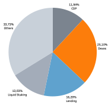
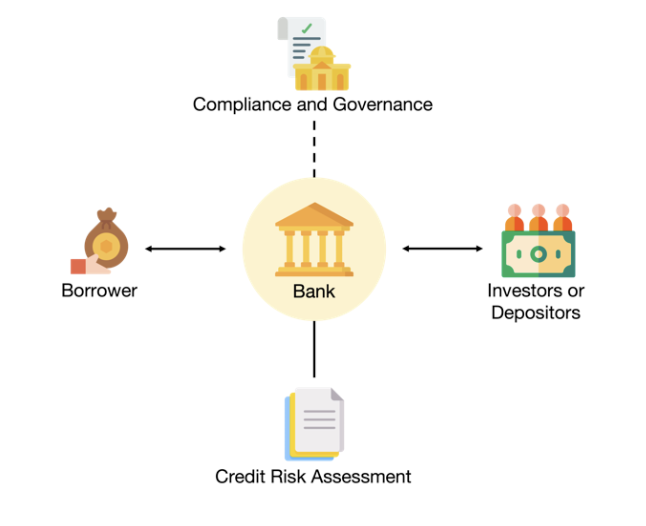
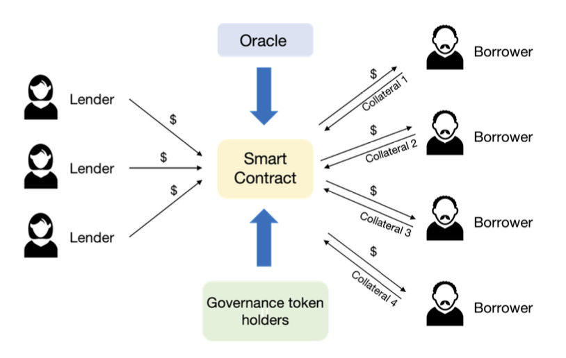
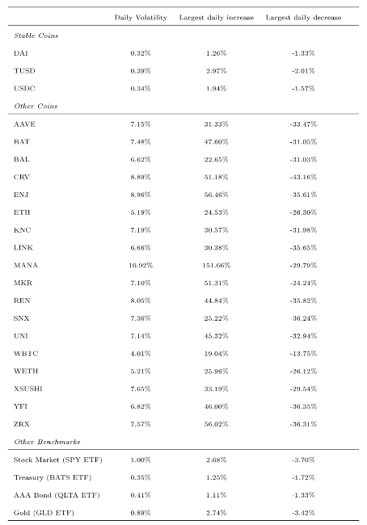
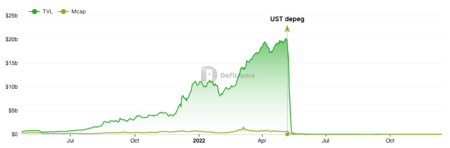

# <center> Could Decentralised Finance (De-Fi) Lending Ready to Replace Traditional Lending Market Already? </center>

## I. Introduction <br>

Decentralised Finance's (De-Fi) emergence has disrupted the world of conventional lending and borrowing. De-Fi might promote direct links between lenders and borrowers via blockchain technology and smart contracts, bypassing intermediaries such as banks and financial institutions. This innovative application of blockchain technology in the field of economics offers substantial advantages over the conventional loan market, including a higher rate of return for lenders, more market accessibility, and a reduction in the cost of financial intermediation. <br><br>
However, there are restrictions and hurdles associated with DeFi lending, such as significant volatility, security threats, and a lack of regulation. Therefore, despite its benefits, DeFi lending still has a significant amount of work to undergo before it can replace traditional lending markets. <br><br>
This essay will examine the key differences and distinctions between DeFi and conventional lending markets, as well as the potential benefits and drawbacks of DeFi lending. The potential adoption of "Embedded Regulation" on the De-Fi market will also be discussed.

## II. Background

Blockchain technology is an immutable, distributed ledger that enables transparent, quick, and secure asset transactions and tracking in a corporate network. Any value could theoretically be recorded and tracked on a blockchain network (Laurence, 2019). There are many implementations using blockchain, one of which is Decentralised Finance or (De-Fi). De-Fi is a by-product of blockchain technology that alters the underlying financial ecosystem. De-Fi contains some protocols or autonomous programmes explicitly trying to tackle financial issues in finance. De-Fi protocols are designed to disintermediate parties via new services and current agreements (Gogel et al., 2021). As of 10 December 2022, according to data aggregated in DeFiLlama, 2139 protocols are running in DeFi with a total TVL of more than $70 billion, of which 16% is accounted for by DeFi lending (Figure 1).



### Lending in Centralised Finance (Ce-Fi)
Long ago in 1404 at Genoa, the lending market in centralised finance that includes banks as middlemen was established (Roberds and Velde, 2016). In lending market typically involves a financial institution such as bank extending a loan to a borrower (Figure 2) The borrower provides collateral in standard assets to secure the loan and required to evaluate the creditworthiness of debtors. The intermediaries or banks establish suitable interest rates to account for default. In the end, the borrower promises to repay the loan plus interest over an agreed-upon time period. <br><br>




### Lending in Decentralised Finance (De-Fi)
In 2006, LendingClub was the first FinTech platform to attempt to assume the function of banks. Through a process of peer-to-peer matching, this platform matched investors with prospective borrowers. In addition, it utilises machine learning to develop an innovative credit rating algorithm (Jagtiani and Lemieux, 2019). In the year 2020, Defi Lending Protocols attempted to eliminate all middlemen, match the borrower with the lender, and administer the transaction through the blockchain ecosystem. DeFi's loan market is anonymous and operates automatically via blockchain technology (Figure 3).



It does not require a credit history as the borrower fulfil the smart contract agreement, which is typically used as collateral. In the smart contracts, the lending terms (such as interest rates and gas fees) are pre-programmed. The collateral assets held are based on price feeds provided by a De-Fi oracle. Governance token holders regulate the system in a decentralised manner (Chiu et al., 2022). 

## Benefits and Risks

### Advantages of Defi Lending Over Traditional Lending

Lenders earn higher interest rates that often far exceed the yield that bank deposits or other low-risk instruments like money market funds provide (Aramonte et al., 2022). Second, because there is no necessity to submit a credit score or other review prior to a loan, this approach could boost financial inclusion and reach more unbanked individuals (Gogel et al., 2021). The third is bring down the cost of financial intermediation as smart contracts can complement automated underwriting in traditional finance (IMF, 2022).

### Risks

Based on our observations, there are two perspectives on the risk of DeFi lending. The first is from the lending-borrowing activities, and the second is from the built-in technologies.

#### Defi Lending’s Mechanics Risk 
Since all lending and borrowing can be cancelled at any moment, DeFi lending is often short-term (Chiu et al., 2022). Therefore, it has the same risk as short-term borrowing securities (e.g., repurchase agreement) as the borrower is at risk of failing to repurchase its collateralised assets. It is similar to what happened in the 2007 crisis (Gorton and Metrick, 2012). Secondly is the inherent risk of crypto market volatility (Figure 4). The value of the digital assets may have decreased significantly since their initial sale, and the borrower's stored assets may be under-collateralised. In addition, the assets could be liquidated and subject to a severe penalty (such as a 13% liquidation penalty in MakerDao).



Finally, we have crypto-interconnectedness. Defi lending is associated with multiple factors and can worsen boom-bust cyclicality. It implies that a disruption in one area of the DeFi ecosystem could affect other systems. The recent collapse of the algorithmic stablecoin TerraUSD is evidence of this (Figure 5).



#### Defi Lending’s Technology or System Risk
Because DeFi lending relies primarily on self-executing programmes that contain the terms and conditions of a financial transaction, the first concern is smart-contract exploitation. In that instance, attackers might use it to steal funds or manipulate the market or deplete the smart contract's funds. bZx, a DeFi lending platform that suffered two different attacks in February 2020, is an example of this exploit (Wang et al., 2021). Finally, the attacker utilised a flaw in the smart contract of bZx to borrow more than $1 million without giving collateral. 

## Conclusion and Recommendations

DeFi lending could reform traditional market lending by providing an alternative that is more accessible and transparent. This technology offers lenders higher yields, potentially broadening financial inclusiveness and lowering the cost of intermediation. <br>
However, DeFi lending is still relatively new, and many challenges must be overcome before it can truly replace traditional lending markets. The tremendous volatility and liquidity of cryptocurrencies, as well as the absence of regulatory frameworks for DeFi lending, can produce uncertainty and risk for both borrowers and lenders. <br>
Therefore, because the implementation of DeFi lending is inherently detached from any institution, it should and could be integrated with regulation and overseen by authorised entities, so-called embedded supervision – which would lower the risk of liquidity and technology failures (Auer, 2019). Secondly, as DeFi lending is procyclical, it should engage in large-scale tokenisation of real-world assets to lessen speculation, such as buildings or capital equipment, to serve as collateral underpinning loans (Aramonte et al., 2022). <br>
Despite these challenges, the outlook for DeFi lending is promising. As the technology continues to evolve and more individuals become aware of its benefits, DeFi lending is anticipated to gain traction and potentially challenge traditional loan markets. Long-term, DeFi lending may facilitate a more inclusive and equitable financial system in which individuals and small enterprises have better access to credit and financial services.

```
p.s: this essay is a product of my course assignment related to fintech infrastructures. The essay's given word limit and should be extended in some area. Some extensions will be considered later.
```


##  References
- Aramonte, S., Doerr, S., Huang, W., Schrimpf, A., 2022. DeFi lending: intermediation without information? Bank Int. Settl. 7. <br>
Auer, R., 2019. Embedded Supervision: How to Build Regulation into Blockchain Finance. Fed. Reserve Bank Dallas Glob. Inst. Work. Pap. 2019. https://doi.org/10.24149/gwp371 <br>
- Chiu, J., Ozdenoren, E., Yuan, K., Zhang∗, S., 2022. On the Inherent Fragility of DeFi Lending 39. <br>
- Gogel, D., Deshmukh, S., Geest, A., Resas, D., Sillaber, C., 2021b. DeFi Beyond the Hype. Whart. Sch. UPenn World Econ. Forum 13. <br> 
- Gorton, G., Metrick, A., 2012. Securitized banking and the run on repo. J. Financ. Econ. 104, 425–451. https://doi.org/10.1016/j.jfineco.2011.03.016 <br>
IMF, 2022. The Rapid Growth of Fintech, Global Financial Stability Report, April 2022, Chapter 3. International Monetary Fund. <br>
- Jagtiani, J., Lemieux, C., 2019. The roles of alternative data and machine learning in fintech lending: Evidence from the LendingClub consumer platform. Financ. Manag. 48, 1009–1029. https://doi.org/10.1111/fima.12295 <br>
- Laurence, T., 2019. Blockchain for dummies, 2nd edition. ed, For dummies. John Wiley & Sons, Inc, Hoboken, NJ. <br>
- Roberds, W., Velde, F.R., 2016. Early Public Banks I: Ledger-Money Banks, in: Fox, D., Ernst, W. (Eds.), Money in the Western Legal Tradition: Middle Ages to Bretton Woods. Oxford University Press, p. 0. https://doi.org/10.1093/acprof:oso/9780198704744.003.0017 <br>
- Wang, B., Liu, H., Liu, C., Yang, Z., Ren, Q., Zheng, H., Lei, H., 2021. BLOCKEYE: Hunting for DeFi Attacks on Blockchain, in: 2021 IEEE/ACM 43rd International Conference on Software Engineering: Companion Proceedings (ICSE-Companion). Presented at the 2021 IEEE/ACM 43rd International Conference on Software Engineering: Companion Proceedings (ICSE-Companion), IEEE, Madrid, ES, pp. 17–20. https://doi.org/10.1109/ICSE-Companion52605.2021.00025

