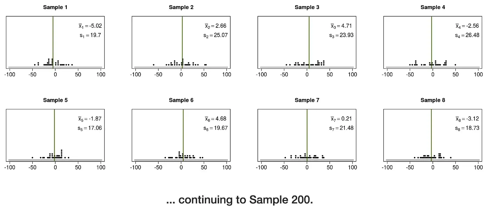
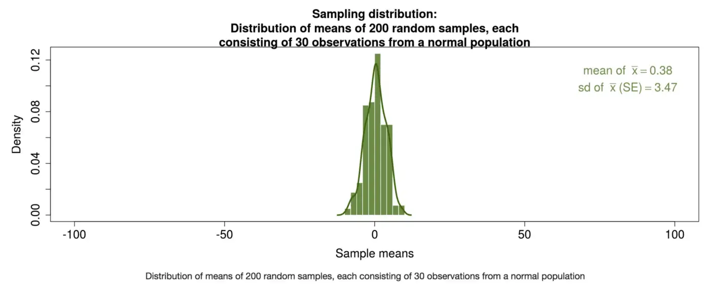

## Statistics for Business (Part#1)

Hello, this is my first post of this blog! Especially in data world. This blog actually is a tool to make me remind again what i have learned. One particular reason is to refresh short-term memory of mine from my learning and working experience. First thing first, Disclaimer: This blogpost typically wont explain about deep math and list of differential formulas used for proofing something mathematically (this writer hasn’t any knowledge of them all), but more about fun things: visualization and intuitive!

Well, for this time I write about a course that i’ve finished several days ago. A Udemy course, is titled “Statistics for business analytics” by Kirill Eremenko as the author and Vitaly Dolgov as his mentor (his professional life mentor, not kinda course mentor). This blog will be explained in several part, maybe 3 or more but not less.

…

So why statistics? all the data scientist task require statistics to know how to leverage those myriad amount of data, even a data analyst surely need statistics to make their data more understandable. If you type in google “why do we have to learn statistics for data science?” you gonna get your answer there. Indeed, a data scientist must be the one who understand statistics more than programmer also understand code more than statistician as well.

This course mainly cover hypothesis testing in advanced. Even though, We know Stats has very wide coverage aspects, this course enough to help us to survive as “early entry of data scientist phase”.

In this blog Series. we try to cover 3 segments, 1 Central Limit Theorm, 2 Hypothesis Testing, 3 advanced hypothesis testing. This post we’ll talk about CLT first!

Hop onto more less serious part!

The Central Limit Theorem (CLT), and the concept of the sampling distribution, are critical for understanding why statistical inference works.

CLT is a statistical theory that given a sufficiently large of sample size from the population the mean of all those samples from the same population will be equally close to the mean of the population. Furthermore, all of the samples will follow an approximate normal distribution pattern. With the standard deviation being approximately equal to the standard deviation of the population divided by the sample’s size.

Let’s jump into example, if we have a random value of the parent distribution (population) mean = 0; std dev = 22; #of data: unknown; distribution: normal; the vis like this:

Assume, we don’t have any computation resource to know the mean of the enormous volume of data. but we have to know what’s the average / mean of the population. We can done this by using CLT, as it mentioned above if we have samples with sufficient number of size (30 really enough), choose randomly, and make around 200 samples (with replacements is okay) then average the result. The mean of the cumulation sample and the mean of the population will closely same!

The distribution of the all samples actually going to be normal distribution as well, no mater the parent population distribution’s shape.

One more thing: as we increase the size of the sample, the variance/standard deviations is getting lower, this is the vis: (N is size of each sample, Rej. rate: is the areas of rejection if we set p-value under 5%).

If you want to play with CLT’s dashboard created by shinny you can access here. The part#2 of the blogpost series will talk about the CLT application in the real word, and more advanced CLT foundation~.

Advice please welcome and be gentle, newbie is here :D